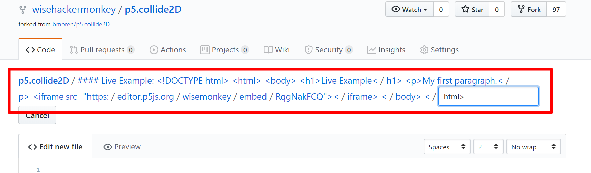

# fuck-with-github
test repo to test weird url names

# my inital descovery 
#### when i accedentlly copied a iframe text into the github file name creation
#### it did someting weird

# Results
#### Looks like my strings crash github desktop!

